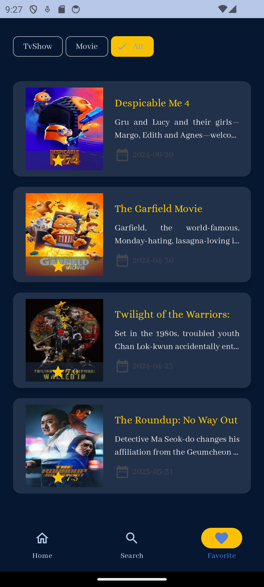

<h1 align="center"> Movie App </h1>
<br>
<p align="center">
    
</p>
This app allows users to explore upcoming, top-rated, and now-playing movies and TV shows. With features like real-time search, detailed movie/TV show information, and a favorite system, the app provides a comprehensive browsing experience.
<br>
<br>


## Screenshots 

<p align="center">
      
<br>
<br>
  
  
  
  
</p>


## Demo
[](https://drive.google.com/file/d/1DkZ1eVNNIXkJD43h_OjvNKf5lDmY1Pwg/view?usp=drive_link)


[Show Demo Video](https://drive.google.com/file/d/1DkZ1eVNNIXkJD43h_OjvNKf5lDmY1Pwg/view?usp=drive_link)


## Features
* View top-rated, upcoming, and now-playing movies and TV shows
* View detailed information about movies and TV shows, including cast, crew, ratings, and synopsis
* Efficiently load and display large datasets using Paging 3
* Users can like movies and TV shows, which are then saved to the favorites section.
* Favorites can be filtered by type (movie or TV show).
* Users can search for movies and TV shows by typing the title.

  
## Tech Stack

* Clean Architecture(MVVM)
* Single Activity
* Jetpack Navigation Component
* Retrofit - Network Requests
* Hilt - Dependency Injection
* Paging 3 - Library for loading and displaying paginated data in a Jetpack Compose LazyColumn
* Two-Pane Layout - For large screens, such as tablets, to improve user experience.
* [TMDB API](https://developer.themoviedb.org/)

## Getting Started
To get started with the WeatherApp, follow these steps:

1- Clone the repository:
```
   git clone https://github.com/AtefehTaheri/MovieProject.git
```
2- Open the project in Android Studio.<br>
3- Get [TMDB Api Key](https://developer.themoviedb.org/) and add to local.properties with "API_KEY" tag
```
   API_KEY="<INSERT_YOUR_API_KEY>"
```
4- Build and run the application on your emulator or device.

[](https://github.com/AtefehTaheri/MovieProject/releases)

or Get .APK : [Releases](https://github.com/AtefehTaheri/MovieProject/releases)
